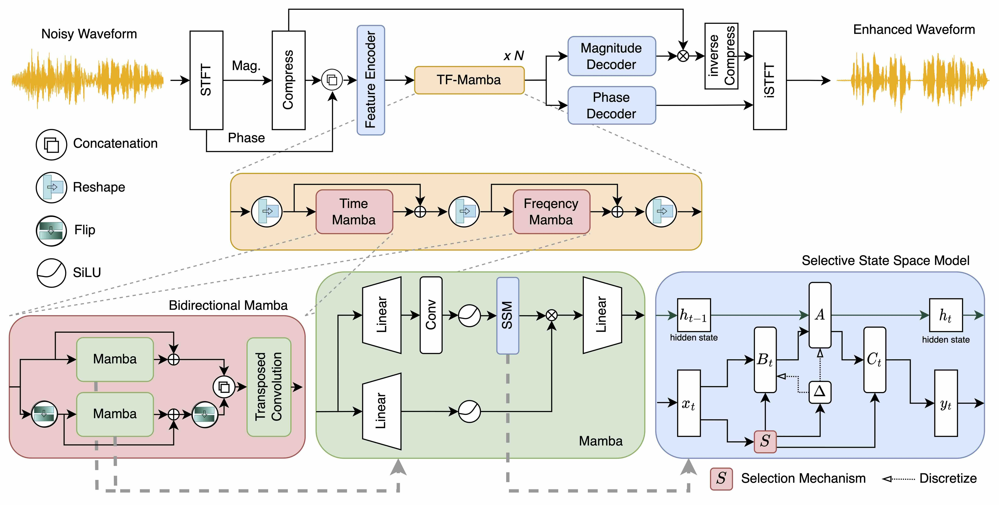
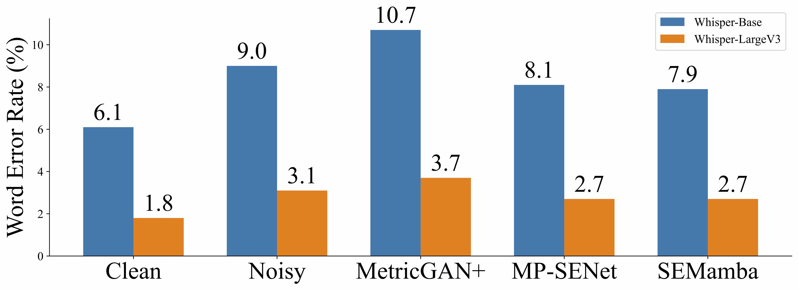

# SEMamba
This is the official implementation of the SEMamba paper.  
For more details, please refer to: [An Investigation of Incorporating Mamba for Speech Enhancement](https://arxiv.org/abs/2405.06573)

## Requirement
    * Python >= 3.9
    * CUDA >= 12.0
    * PyTorch == 2.2.2

## Additional Notes

1. Ensure that both the `nvidia-smi` and `nvcc -V` commands show CUDA version 12.0 or higher to verify proper installation and compatibility.

2. Currently, it supports only GPUs from the RTX series and newer models. Older GPU models, such as GTX 1080 Ti or Tesla V100, may not support the execution due to hardware limitations.

## Installation
### (Suggested:) Step 0 - Create a Python environment with Conda

It is highly recommended to create a separate Python environment to manage dependencies and avoid conflicts.
```bash
conda create --name mamba python=3.9
conda activate mamba
```

### Step 1 - Install PyTorch

Install PyTorch 2.2.2 from the official website. Visit [PyTorch Previous Versions](https://pytorch.org/get-started/previous-versions/) for specific installation commands based on your system configuration (OS, CUDA version, etc.).

### Step 2 - Install Required Packages

After setting up the environment and installing PyTorch, install the required Python packages listed in requirements.txt.

```bash
pip install -r requirements.txt
```

### Step 3 - Install the Mamba Package

Navigate to the mamba_install directory and install the package. This step ensures all necessary components are correctly installed.

```bash
cd mamba_install
pip install .
```

Note: Installing from source (provided `mamba_install`) can help prevent package issues and ensure compatibility between different dependencies. It is recommended to follow these steps carefully to avoid potential conflicts.

## Training the Model
### Step 1: Prepare Dataset JSON

Create the dataset JSON file using the script `sh make_dataset.sh`. You may need to modify `make_dataset.sh` and `data/make_dataset_json.py`.

Alternatively, you can directly modify the data paths in `data/train_clean.json`, `data/train_noisy.json`, etc.

### Step 2: Run the following script to train the model.

```bash
sh run.sh
```

Note: You can use `tensorboard --logdir exp/path_to_your_exp/logs` to check your training log

## Using the Pretrained Model

Modify the `--input_folder` and `--output_folder` parameters in `pretrained.sh` to point to your desired input and output directories. Then, run the script.

```bash
sh pretrained.sh
```

## Implementing the PCS Method in SEMamba
There are two methods to implement the PCS (Perceptual Contrast Stretching) method in SEMamba:
1. Use PCS as Training Target:
- Run the `sh runPCS.sh` with the yaml configuration `use_PCS400=True`.
- Use the pretrained model `sh pretrained.sh` without post-processing `--post_processing_PCS False`.

2. Use PCS as Post-Processing:
- Run the `sh run.sh` with the yaml configuration `use_PCS400=False`.
- Use the pretrained model `sh pretrained.sh` without post-processing `--post_processing_PCS True`.

## Model



## ASR Word Error Rate
We have tested the ASR results using OpenAI Whisper on the test set of VoiceBank-DEMAND.
> The evaluation code will be released in the future.



## Evaluation
The evaluation metrics is calculated via: [CMGAN](https://github.com/ruizhecao96/CMGAN/blob/main/src/tools/compute_metrics.py)  
> The evaluation code will be released in the future.

## Perceptual Contrast Stretching
The implementation of Perceptual Contrast Stretching (PCS) as discussed in our paper can be found at [PCS400](https://github.com/RoyChao19477/PCS/tree/main/PCS400).

## References and Acknowledgements
We would like to express our gratitude to the authors of [MP-SENet](https://github.com/yxlu-0102/MP-SENet/tree/main), [CMGAN](https://github.com/ruizhecao96/CMGAN), [HiFi-GAN](https://github.com/jik876/hifi-gan/blob/master/train.py), and [NSPP](https://github.com/YangAi520/NSPP).

## Citation:
If you find the paper useful in your research, please cite:  
```
@article{chao2024investigation,
  title={An Investigation of Incorporating Mamba for Speech Enhancement},
  author={Chao, Rong and Cheng, Wen-Huang and La Quatra, Moreno and Siniscalchi, Sabato Marco and Yang, Chao-Han Huck and Fu, Szu-Wei and Tsao, Yu},
  journal={arXiv preprint arXiv:2405.06573},
  year={2024}
}
```
